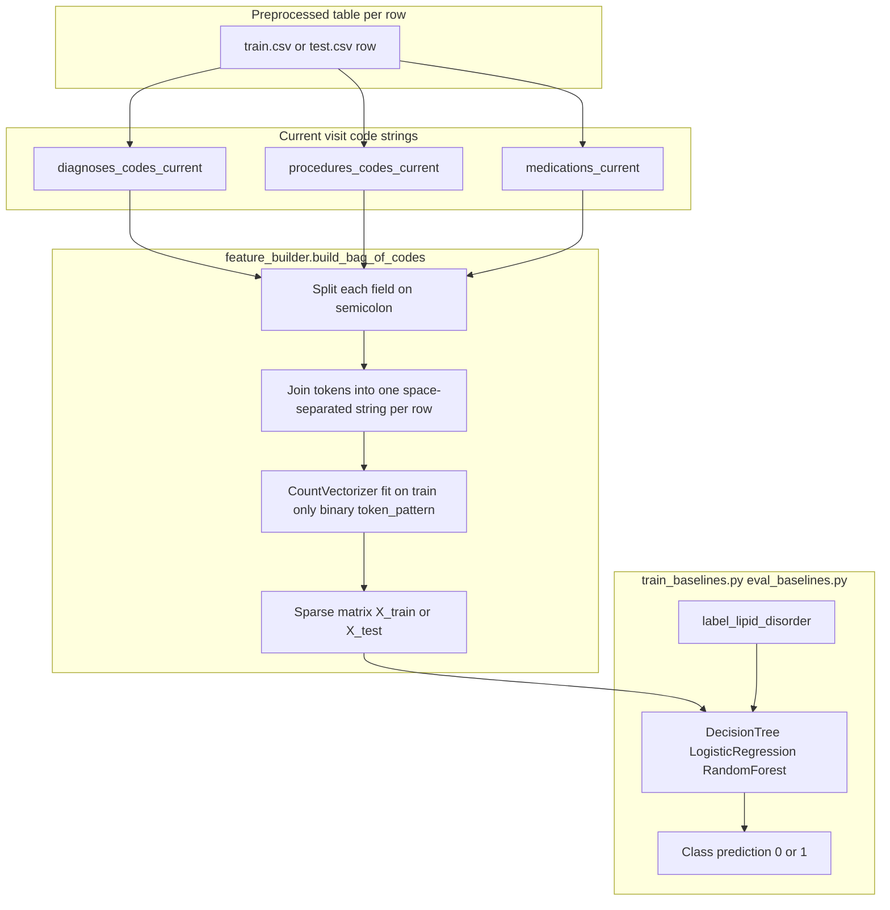
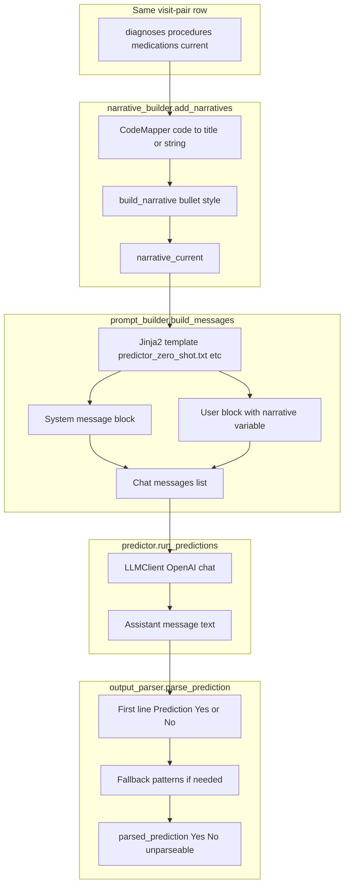

# ML vs LLM Inputs: Sources, Processing, and Examples

This document explains **what goes into the classical ML models** versus **what goes into the LLM**, how each is produced in code, and **concrete examples** for each path.

---

## Diagrams — step-by-step input flows

The figures below show **how data moves from preprocessed visit-pair rows into each model family**. File references point to the implementation.

### Classical ML (`bag_of_codes`, default)



**Few-shot ML:** The same featurizer runs, but **training rows** are replaced by a **small exemplar subset** (`ml.few_shot_n` rows); `X_test` still comes from the full test set.

### LLM (zero-shot; few-shot and co-agent add blocks)



**Few-shot:** Between `Nar` and `Tpl`, the template also receives **`demonstration_cases`** (exemplar narratives + Outcome Yes/No from **train** only).

**Co-agent test pass:** Same as few-shot template (`predictor_coagent_base.txt`) plus **`critic_feedback`** text under Refined Criteria, produced after calibration + critic + consolidation (`src/llm/coagent.py`).

---

## Part A — Classical ML models

### A.1 What the models predict

For every **visit pair** row, the label is binary **`label_lipid_disorder`**: whether a lipid-metabolism ICD-9 code appears in the **next** admission (see `src/data/build_target_labels.py`). The models use only information from the **current** visit.

### A.2 Raw input fields (from preprocessing)

For each row in `train.csv` / `test.csv`, the feature builder reads **structured code strings for the current visit only**:

| Column | Meaning |
|--------|---------|
| `diagnoses_codes_current` | Semicolon-separated ICD-9 diagnosis codes for the current admission |
| `procedures_codes_current` | Semicolon-separated ICD-9 procedure codes |
| `medications_current` | Semicolon-separated drug names (from prescriptions) |

These come from MIMIC-III tables aggregated per `HADM_ID` during `build_visits` / `build_pairs` (`src/data/build_patient_visits.py`, `src/data/build_visit_pairs.py`).

### A.3 Default processing: `bag_of_codes` (config: `ml.feature_type`)

**Implementation:** `src/ml/feature_builder.py` → `build_bag_of_codes`.

1. For each row, the three columns are **split on `;`**, tokens are **concatenated into one space-separated string** (diagnoses, then procedures, then medications — order preserved by column order, not clinically weighted).
2. **`sklearn.feature_extraction.text.CountVectorizer`** is applied with:
   - `binary=True` → each token is **present/absent** (multi-hot), not counts.
   - `token_pattern=r"[^\s]+"` → any non-whitespace token is a “word” (so codes like `V4581` or drug names stay as tokens).
3. The vectorizer is **`fit` on the training set** only; the test set is **`transform`ed** so the vocabulary is defined by training data (standard for avoiding leakage in vocabulary).

**Target vector:** `label_lipid_disorder` (0/1).

### A.4 Optional processing: `tfidf`

If `ml.feature_type` is set to **`tfidf`**, features are built from the text column **`narrative_current`** (see Part B) using **`TfidfVectorizer`** (`max_features=5000`, English stop words). Default experiment uses **`bag_of_codes`**, not TF-IDF.

### A.5 Complete ML example (illustrative)

**Hypothetical single row (current visit):**

```text
diagnoses_codes_current:  25000;4019;2724
procedures_codes_current: 0066
medications_current:      Metformin;Atorvastatin
```

**Step 1 — token string for that row:**

```text
25000 4019 2724 0066 Metformin Atorvastatin
```

**Step 2 — after `CountVectorizer` (binary) fit on many training rows:**  
Each distinct token across training becomes a dimension; this row’s vector has `1` at indices for tokens that appear and `0` elsewhere (very high-dimensional, sparse).

**Training:** `X_train`, `y_train` from `train_df`.  
**Evaluation:** `X_test` vs `y_test` from `test_df`.

**Few-shot ML:** The same feature pipeline is run with a **tiny training set** of `few_shot_n` exemplar rows (default 6) instead of the full `train_df` (`src/scripts/run_ml_baselines.py`).

---

## Part B — LLM inputs

### B.1 Primary text source: `narrative_current`

The LLM **does not** read the raw semicolon code strings by default. It reads a **single string per visit pair**: **`narrative_current`**.

**How narratives are built:** `src/data/narrative_builder.py` → `add_narratives`.

1. **`diagnoses_codes_current`**, **`procedures_codes_current`**, **`medications_current`** are passed through **`CodeMapper`** (`src/data/code_mappings.py`), which maps ICD/drug codes to **human-readable titles** (from MIMIC dictionaries where available).
2. Lists are **truncated** to `max_diagnoses`, `max_medications`, `max_procedures` (defaults in `configs/default.yaml` → `narrative` section).
3. **`build_narrative`** formats them in **bullet style** (default):

```text
- Diagnoses made: <names...>
- Medications prescribed: <names...>
- Procedures performed: <names...>
```

So the LLM input is **English clinical text**, not raw ICD strings (unless mapping failed and a raw code slipped through).

### B.2 How prompts are assembled

**Templates:** files under `prompts/` (Jinja2 blocks `system` / `user`).  
**Rendering:** `src/llm/prompt_builder.py` → `build_messages(template_file, narrative, demonstration_cases, critic_feedback)`.

| Mode | Template file | Variables injected into user message |
|------|----------------|--------------------------------------|
| Zero-shot | `predictor_zero_shot.txt` | `narrative` only |
| Zero-shot+ | `predictor_zero_shot_plus.txt` | `narrative` + extra instructions (e.g. prevalence hint in template) |
| Few-shot | `predictor_few_shot.txt` | `narrative` + `demonstration_cases` |
| Co-agent | `predictor_coagent_base.txt` | `narrative` + `demonstration_cases` + `critic_feedback` |

**API call:** `src/llm/predictor.py` loads each row’s `narrative_current`, builds **chat messages** `[{role: system, content: ...}, {role: user, content: ...}]`, and sends them to the configured provider (`configs/default.yaml` → `llm`, default **OpenAI** `gpt-4o-mini`).

**Artifacts:** First sample’s rendered prompt is saved under `data/outputs/mimiciii/prompts_used/<mode>/prompt_sample_<pair_id>.txt`; each response is saved under `raw_llm_responses/<mode>/<pair_id>.json`.

### B.3 Few-shot block (`demonstration_cases`)

**Source:** Training rows only — `select_exemplars` in `src/data/exemplar_selector.py` (e.g. 3 positive + 3 negative by default).

**Formatting:** `format_exemplar_block` produces:

```text
Case 1:
<narrative_current of exemplar 1>
Outcome: Yes

Case 2:
...
Outcome: No
```

That entire string is **`demonstration_cases`** in the few-shot and coagent templates.

### B.4 Co-agent: `critic_feedback`

After calibration few-shot predictions and critic batches, **consolidated text** from the critic is passed as **`critic_feedback`** into `predictor_coagent_base.txt` under **`[Refined Criteria]`** (see template).

---

## Part C — LLM output parsing

**Implementation:** `src/llm/output_parser.py` → `parse_prediction`.

The model’s **assistant message text** is parsed as follows:

1. **First line:** Prefer `Prediction: Yes` or `Prediction: No` (or `Yes` / `No` alone on line 1).
2. **Else:** Search for `Prediction: Yes` / `Prediction: No` anywhere in the text.
3. **Else:** Use the **first** standalone `Yes` vs `No` by position in the string.
4. If still ambiguous → **`unparseable`**.

**Downstream:** `src/evaluation/evaluate_llm_runs.py` maps `Yes`→1, `No`→0, drops `unparseable` for metric computation and records counts in `llm_*_metrics.json`.

Optional: if the API returns **logprobs** and `request_logprobs` is enabled, `extract_logprob_confidence` can derive `prob_yes` / `prob_no` (off by default in `configs/default.yaml`).

---

## Part D — Full LLM examples (minimal, synthetic)

### D.1 Zero-shot

**`narrative` passed into the user block:**

```text
- Diagnoses made: Diabetes mellitus without mention of complication; Essential hypertension
- Medications prescribed: Metformin; Lisinopril
- Procedures performed: None recorded
```

**Expected model reply shape (first line must be parseable):**

```text
Prediction: No
The current visit does not show strong lipid-related diagnoses or lipid-focused therapy; ...
```

### D.2 Few-shot (excerpt)

**`demonstration_cases` (abbreviated):**

```text
Case 1:
- Diagnoses made: Pure hypercholesterolemia
- Medications prescribed: Atorvastatin
- Procedures performed: None recorded
Outcome: Yes

Case 2:
- Diagnoses made: Pneumonia; Sepsis
- Medications prescribed: Ceftriaxone
- Procedures performed: None recorded
Outcome: No
```

**`narrative`:** new patient bullet text as in D.1.  
The user template wraps definition + instructions + demonstration cases + output format (`prompts/predictor_few_shot.txt`).

### D.3 Co-agent

Same as few-shot, plus **`critic_feedback`** under `[Refined Criteria]`, e.g.:

```text
Prior errors often missed 272.x codes when statins were present without explicit lipid diagnoses; prioritize documented 272.x in the next visit diagnosis list.
```

---

## Part E — Quick reference table

| Aspect | ML (`bag_of_codes`) | LLM |
|--------|---------------------|-----|
| **Input** | Semicolon code + med strings from **current** visit | **`narrative_current`** (mapped names, bullet format) |
| **Processing** | Split `;` → tokens → binary CountVectorizer | Jinja2 prompt + optional exemplars + optional critic text |
| **Label for training** | `label_lipid_disorder` | N/A (inference only; label used only for evaluation) |
| **Output** | Class 0/1 from `predict()` | Free text → **`parse_prediction`** → Yes/No/unparseable |

---

*Code references: `src/ml/feature_builder.py`, `src/data/narrative_builder.py`, `src/llm/prompt_builder.py`, `src/llm/predictor.py`, `src/llm/output_parser.py`, `prompts/predictor_*.txt`.*
