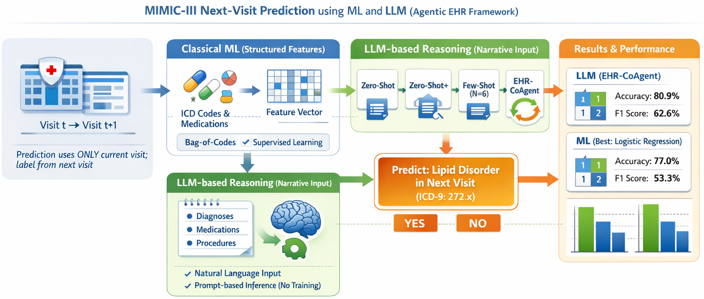

# EHR-Agentic-AI



This README summarizes the repository’s MIMIC-III next-visit prediction pipeline, including ML and LLM input pathways, implemented approaches, archived results, documentation map, and reproducible run commands.

Predict whether **Disorders of Lipid Metabolism** (ICD-9 `272.x` / CCS-53) appear on a patient’s **next** hospital admission, using the **current** admission only — implemented on **MIMIC-III** visit pairs with classical ML baselines and the same four **LLM** prompt modes on **OpenAI `gpt-4o-mini`** and **local `google/gemma-4-e4b-it`** (zero-shot, zero-shot+, few-shot, EHR-CoAgent).

---

## Table of Contents
- [1. How inputs are fed: ML vs LLM](#1-how-inputs-are-fed-ml-vs-llm)
- [2. Approaches](#2-approaches)
- [3. Results (full pipeline run)](#3-results-full-pipeline-run)
- [4. Documentation](#4-documentation)
- [5. Repository layout (main)](#5-repository-layout-main)
- [6. Quick start](#6-quick-start)
- [7. License and data use](#7-license-and-data-use)

## 1. How inputs are fed: ML vs LLM

| Track | What the model sees | Where it comes from |
|--------|---------------------|---------------------|
| **Classical ML** | **Bag-of-codes** features: diagnosis, procedure, and medication strings from the **current** visit are tokenized into a sparse binary representation (`feature_type: bag_of_codes` in `configs/default.yaml`). | Built in `src/ml/` from `train.csv` / `test.csv`. |
| **LLM** | A single **natural-language narrative** per visit pair: bulleted **diagnoses**, **medications**, and **procedures** for the **current** visit (`narrative_current`). | Built during preprocessing; Jinja templates in **`prompts_v2/`** (config: `llm.prompt_template_dir`) fill `{{ narrative }}` (and optional few-shot `{{ demonstration_cases }}`, co-agent `{{ critic_feedback }}`). The model returns `Prediction`, `Probability`, and `Reasoning`; ROC-AUC / AUPRC use parsed probabilities when valid. |

The **label** is the same for both tracks: derived from **next-visit** diagnosis codes only (the model never sees the next visit text). See `METHODOLOGY.md` and `src/data/build_target_labels.py`.

---

## 2. Approaches

**Classical ML** (`src/scripts/run_ml_baselines.py`)

- **Fully supervised** — Decision tree, logistic regression, random forest trained on the **full** training split.
- **Few-shot ML** — The same three models each trained on only **N = 6** labeled rows (`ml.few_shot_n`), same bag-of-features (not the same mechanism as LLM few-shot).

**LLM** (`src/scripts/run_*.py`; API GPT-4o-mini vs local Gemma per config / `LLM_MODEL_NAME`)

- **Zero-Shot** — Instructions + current narrative only.
- **Zero-Shot+** — Adds prevalence context and longer analysis instructions (still no labeled examples).
- **Few-Shot (N=6)** — Six **in-context** exemplars (3 positive / 3 negative) sampled from **train** only; **no weight updates**.
- **EHR-CoAgent** — Few-shot-style prompt plus **critic** feedback from mispredictions on a **calibration** subset of train, then consolidated text injected into `predictor_coagent_base.txt`.

Details: `docs/llm_prompt_modes_explained.md`, `docs/LLM_EXPERIMENT_REPORT_GPT4O_MINI.md`.

---

## 3. Results (full pipeline run)

Aggregated metrics (**ACC**, **Sensitivity**, **Specificity**, **F1**, %) on the stratified **20%** test hold-out (seed **42**); positive prevalence on test ≈ **27.4%**. GPT-4o-mini metrics come from `data/outputs/mimiciii/`; Gemma 4 from `data/outputs/mimiciii_gemma/` (archived comparison runs — **do not reuse those paths for new runs**). New Gemma prompt experiments default to `data/outputs/mimiciii_llm_promptv2_gemma/` (see `configs/default.yaml` and env `EHR_OUTPUTS_DIR`). Rows are sorted by **F1** (same ordering as `docs/COMPARATIVE_RESULTS_REPORT_ML_AND_LLM_GPT4O_MINI_Gemma4.md`). **Caveat:** LLM inputs are **narratives** and ML uses **bag-of-codes** — interpret as an **end-to-end system** comparison, not a controlled model-family ablation.

| Model | Approach | ACC | Sensitivity | Specificity | F1 |
|--------|----------|-----|-------------|-------------|-----|
| google/gemma-4-e4b-it | Zero-Shot+ | 80.97 | 60.61 | 88.66 | **63.59** |
| google/gemma-4-e4b-it | EHR-CoAgent | 79.78 | 62.96 | 86.12 | 63.05 |
| gpt-4o-mini-2024-07-18 | EHR-CoAgent | 80.93 | 58.21 | 89.50 | 62.57 |
| gpt-4o-mini-2024-07-18 | Zero-Shot | 80.82 | 57.69 | 89.55 | 62.24 |
| gpt-4o-mini-2024-07-18 | Few-Shot (N=6) | 80.65 | 57.39 | 89.44 | 61.93 |
| gpt-4o-mini-2024-07-18 | Zero-Shot+ | 80.73 | 56.22 | 89.99 | 61.54 |
| google/gemma-4-e4b-it | Few-Shot (N=6) | 80.10 | 57.83 | 88.50 | 61.43 |
| google/gemma-4-e4b-it | Zero-Shot | 80.26 | 55.93 | 89.44 | 60.83 |
| logistic_regression | Fully Supervised | 77.05 | 47.73 | 88.11 | 53.27 |
| random_forest | Fully Supervised | 76.44 | 24.01 | 96.24 | 35.85 |
| decision_tree | Fully Supervised | 73.48 | 50.66 | 82.09 | 51.15 |
| decision_tree | Few Shot | 61.40 | 56.52 | 63.24 | 44.52 |
| logistic_regression | Few Shot | 35.27 | 90.34 | 14.48 | 43.34 |
| random_forest | Few Shot | 34.95 | 92.53 | 13.21 | 43.81 |

**Readout:** Fully supervised **logistic regression** is the strongest classical baseline (ACC/F1). Both LLM families sit near **~80%** accuracy; **Gemma Zero-Shot+** reaches the highest **F1** in this table, while **GPT EHR-CoAgent** is best within the GPT family on ACC/F1; **Gemma EHR-CoAgent** maximizes sensitivity at lower specificity. **N=6 ML training** is unstable for LR/RF on bag-of-codes, unlike **N=6 in-context** LLM few-shot. Full tables, confusion counts, and cross-model deltas: `docs/COMPARATIVE_RESULTS_REPORT_ML_AND_LLM_GPT4O_MINI_Gemma4.md` ([HTML](docs/COMPARATIVE_RESULTS_REPORT_ML_AND_LLM_GPT4O_MINI_Gemma4.html)).

---

## 4. Documentation

| Document | Purpose |
|----------|---------|
| `METHODOLOGY.md` | Data, split, configs, scripts, outputs |
| `docs/LLM_EXPERIMENT_REPORT_GPT4O_MINI.md` | LLM experiment details, parsing, artifacts |
| `docs/llm_prompt_modes_explained.md` | Zero-shot vs zero-shot+ vs few-shot (LLM) |
| `docs/COMPARATIVE_RESULTS_REPORT_ML_AND_LLM_GPT4O_MINI_Gemma4.md` | Full ML + GPT-4o-mini + Gemma 4 tables and comparisons ([HTML](docs/COMPARATIVE_RESULTS_REPORT_ML_AND_LLM_GPT4O_MINI_Gemma4.html)) |
| `docs/MIMICIII_GEMMA_JOB_46510786_RESULTS_REPORT.md` | Slurm runs for Gemma prompt experiments and EHR-CoAgent (jobs **46510786** / **46615354**) |

---

## 5. Repository layout (main)

| Path | Role |
|------|------|
| `configs/default.yaml` | Main experiment configuration |
| `configs/debug_small.yaml` | Smoke-test overrides |
| `prompts_v2/` | Jinja2 LLM templates (active); `prompts/` kept for legacy reference |
| `src/` | Preprocessing, ML, LLM, evaluation |
| `scripts/` | Shell drivers (`run_mimic_pipeline.sh`, `run_llm_only.sh`, smoke tests) |
| `slurm/` | Cluster job scripts |
| `data/outputs/mimiciii/` | ML + GPT-4o-mini metrics (`summary_table.csv`, `ml_results_*.csv`, `llm_*_metrics.json`) |
| `data/outputs/mimiciii_gemma/` | Archived Gemma 4 metrics, `summary_table.csv`, LLM raw responses (keep read-only for comparison) |
| `data/outputs/mimiciii_llm_promptv2_gemma/` | **Default** output root for new prompt-v2 / probability runs (Gemma); avoids overwriting the folders above |
| `gpt_4o_mini_results/` | Archived historical GPT-4o-mini outputs/logs (gitignored for privacy) |

---

## 6. Quick start

1. **Python 3.10+**, virtual environment recommended.

2. **Install dependencies**

   ```bash
   pip install -r requirements.txt
   ```

3. **Environment variables**
   - For local Gemma (default), first authenticate with Hugging Face if model access is gated:
     ```bash
     huggingface-cli login
     ```
   - Optional overrides:
     ```bash
     export LLM_MODEL_NAME="google/gemma-4-e4b-it"  # switch later to e2b/26b/31b ids
     export HF_HOME="$HOME/.cache/huggingface"
     ```
   - **Separate outputs per run** (recommended so archived `data/outputs/mimiciii*` trees stay untouched):
     - Defaults are in `configs/default.yaml` (`paths.outputs` + `llm.cache_dir` under that folder).
     - One-off directory without editing YAML:
       ```bash
       export EHR_OUTPUTS_DIR="data/outputs/mimiciii_llm_$(date +%Y%m%d_%H%M)"
       # Implies llm.cache_dir = $EHR_OUTPUTS_DIR/llm_cache unless you set EHR_LLM_CACHE_DIR
       # Optional: dedicated LoRA save path so finetune does not overwrite adapters
       export EHR_FINETUNE_OUTPUT_DIR="models/gemma_finetuned_runs/$(date +%Y%m%d_%H%M)"
       ```
     - Equivalent env name: `EXPERIMENT_OUTPUT_DIR` (same behavior as `EHR_OUTPUTS_DIR`).
   - For optional vLLM endpoint routing, set:
     ```bash
     export VLLM_BASE_URL="http://127.0.0.1:8000/v1"
     ```

4. **MIMIC-III data** — Point `configs/default.yaml` → `paths.mimic_raw` at your local PhysioNet extract.

5. **Preserve historical GPT outputs (one-time)**:

   ```bash
   export PYTHONPATH="$(pwd)"
   python -m src.scripts.archive_gpt4o_results
   ```

6. **Run from repo root** with `PYTHONPATH` set:

   ```bash
   export PYTHONPATH="$(pwd)"
   STAGE=full bash scripts/run_mimic_pipeline.sh
   ```

   LLM prompt-only (after `train.csv` / `test.csv` exist):

   ```bash
   export PYTHONPATH="$(pwd)"
   bash scripts/run_llm_only.sh
   ```

   LLM prompt pipeline smoke (uses `configs/debug_small.yaml` → `data/outputs/mimiciii_llm_smoke`, `prompts_v2/`):

   ```bash
   export PYTHONPATH="$(pwd)"
   python -m src.scripts.smoke_llm_prompt_pipeline --config configs/default.yaml --overrides configs/debug_small.yaml
   ```

   Equivalent shell shortcut (local Gemma smoke on GPU):

   ```bash
   STAGE=smoke bash scripts/run_llm_only.sh
   ```

   OpenAI smoke on a **CPU** node (merge `configs/smoke_openai.yaml`):

   ```bash
   export LLM_EXTRA_OVERRIDES="configs/smoke_openai.yaml"
   STAGE=smoke bash scripts/run_llm_only.sh
   ```

   **Full OpenAI + `prompts_v2`** (writes to `data/outputs/mimiciii_llm_gpt4o_mini_promptv2/`; needs `OPENAI_API_KEY`):

   ```bash
   export LLM_OVERRIDES="configs/experiments/openai_gpt4o_mini_promptv2_full.yaml"
   STAGE=full bash scripts/run_llm_only.sh
   ```

   Cluster: `sbatch slurm/mimic_iii_llm_openai_promptv2_full.slurm`

   Fine-tuning (LoRA) with Gemma (`gemma-4-e4b-it`):

   ```bash
   export PYTHONPATH="$(pwd)"
   # Optional first run if processed/train.csv and processed/test.csv are not present yet:
   # python -m src.scripts.run_preprocessing --config configs/default.yaml

   # 1) Smoke test first: tiny train/val split + a few optimizer steps + validation logging
   python -m src.scripts.run_finetune_gemma --config configs/default.yaml --overrides configs/debug_small.yaml --smoke

   # 2) Full fine-tuning experiment (reuses generated train_ft.csv / val_ft.csv by default)
   python -m src.scripts.run_finetune_gemma --config configs/default.yaml
   ```

   Smoke test (small subset, `STAGE=smoke`):

   ```bash
   STAGE=smoke bash scripts/run_mimic_pipeline.sh
   ```

7. **Cluster** — Examples: `sbatch slurm/mimic_iii_full.slurm`; **Gemma 4 LLM smoke (GPU):** `sbatch slurm/mimic_iii_llm_gemma_smoke.slurm`; **OpenAI full LLM + prompt_v2:** `sbatch slurm/mimic_iii_llm_openai_promptv2_full.slurm` (see script headers and `scripts/slurm_llm_env.sh` where applicable).

8. **Fusion (structured + LLM logit probabilities)** — Second-stage models (logistic regression, MLP, Conv1d+Transformer with 4 heads) on bag-of-codes + `prob_yes` / `margin_logit` from the finetuned Gemma scorer. Train scores must never come from the held-out test split. Run order:

   ```bash
   export PYTHONPATH="$(pwd)"
   python -m src.scripts.score_llm_logits_split --config configs/default.yaml --overrides configs/fusion_default.yaml --split train
   python -m src.scripts.score_llm_logits_split --config configs/default.yaml --overrides configs/fusion_default.yaml --split test
   python -m src.scripts.build_fusion_dataset --config configs/default.yaml --overrides configs/fusion_default.yaml
   python -m src.scripts.run_fusion_experiments --config configs/default.yaml --overrides configs/fusion_default.yaml --skip-llm-score --skip-build
   ```

   Or one-shot (scores train+test via subprocess if CSVs missing): `python -m src.scripts.run_fusion_experiments --config configs/default.yaml --overrides configs/fusion_default.yaml`. Artifacts: `{paths.outputs}/fusion/` (`fusion_summary.csv`, `metrics_*.json`, `preds_*.csv`). Design and leakage rules: `docs/fusion_experiment_report.md`.

---

## 7. License and data use

MIMIC-III requires **PhysioNet credentialing**; use of this code does not grant data access. Follow your institution’s rules for PHI and API keys.
